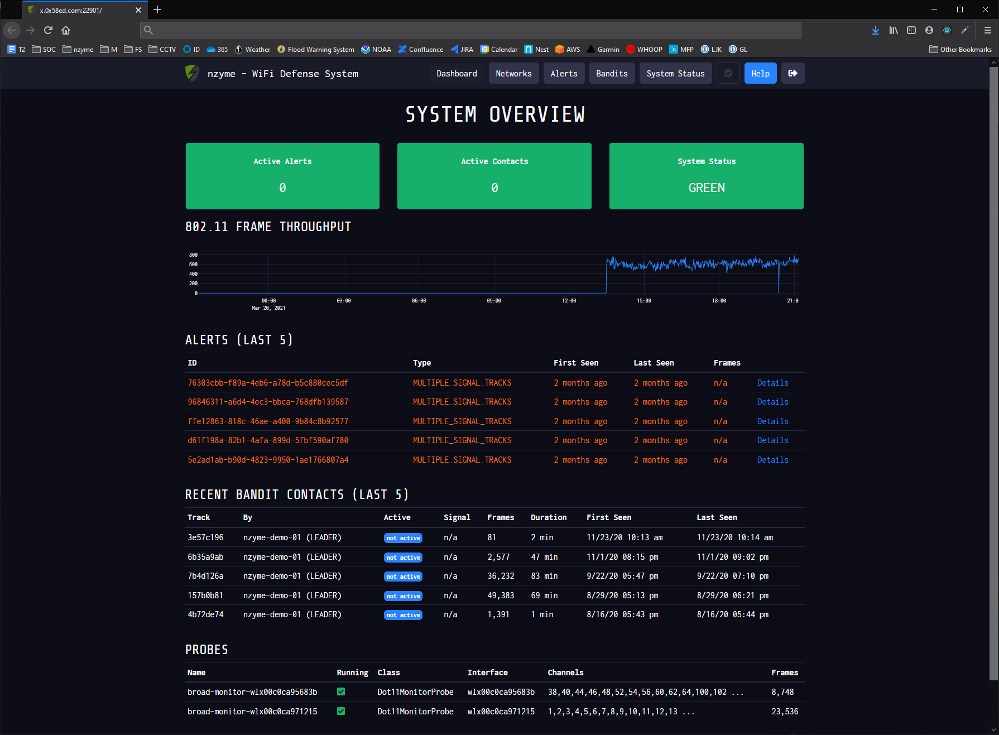

# nzyme - WiFi Defense System

## Introduction

### What is nzyme?

The nzyme project uses WiFi adapters in monitor mode to scan the frequencies for suspicious behavior, specifically rogue access points and known WiFi attack platforms. Each recorded wireless frame is parsed and optionally sent to a [Graylog](https://www.graylog.org/) log management system for long-term storage that allows you to perform forensics and incident response. Ever wondered what to do if you catch a malicious wireless actor? With nzyme, you will be able to reconstruct what happened, who was targeted, and who was successfully compromised.

Several [types of alerts](https://go.nzyme.org/alerting) are automatically raised. The employed techniques range from signature based analysis of expected network infrastructure, threat landscape assessment with fingerprinting to setting traps with deception capabilities.

### What is nzyme not?

nzyme is not designed to be physically moving around in any way. It is supposed to stay stationary and constantly observe the WiFi radio frequency spectrum. If you are looking for a WiFi recon or wardriving tool, you should check out [Kismet](https://www.kismetwireless.net/).

(It obviously won't break from moving around but the interface and some of the functionality won't make much sense anymore.)

## Getting Started

Please visit the [getting started page](https://www.nzyme.org/docs/intro) to get started.

## Contributing

There are many ways to contribute and all community interaction is absolutely welcome:

* Open an issue for any kind of bug you think you have found.
* Open an issue for anything that was confusing to you. Bad, missing or confusing documentation is considered a bug.
* Open a Pull Request for a new feature or a bugfix. It is a good idea to get in contact first to make sure that it fits the roadmap and has a chance to be merged.
* Write documentation.
* Write a blog post.
* Help a user in the issue tracker or the IRC channel (#nzyme on FreeNode.)
* Get in contact and say how you use it or what would be a cool addition.
* Tell the world.

Please be aware of the [Code of Conduct](CODE_OF_CONDUCT.md) that will be enforced across all channels and platforms.

## Legal notice

Make sure to comply with local laws, especially with regards to wiretapping, when running nzyme. Note that nzyme is never decrypting any data but only reading unencrypted data on license-free frequencies.
