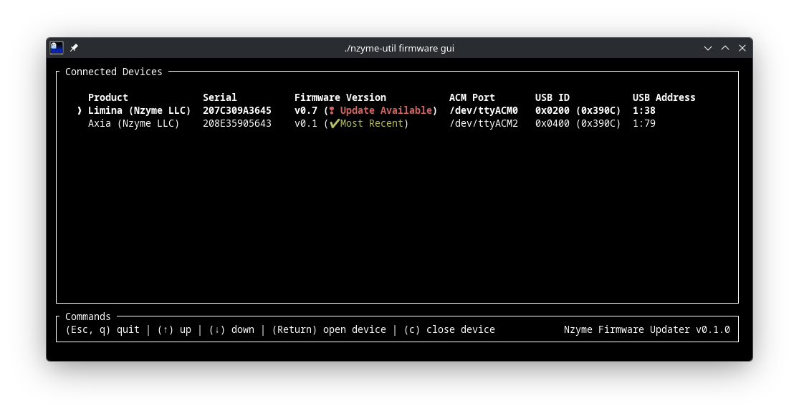

# Nzyme CLI Utility

The Nzyme CLI Utility helps with common Nzyme tasks like upgrading firmware or validating downloaded packages.

## Install Nzyme hardware `udev` rules

// to avoid having to use sudo, but you can

```
SUBSYSTEM=="usb", ATTR{idVendor}=="390c", MODE="0666"

sudo udevadm control --reload-rules
sudo udevadm trigger

$ udevadm cat | grep 390c
SUBSYSTEM=="usb", ATTR{idVendor}=="390c", MODE="0666"
```

## Update Nzyme hardware

The easiest way to update connected Nzyme hardware is to use the GUI application. It will give
you an overview of all connected devices, an indication if a more recent firmware release is 
available and an option to automatically update a device.

You can start the GUI application in your terminal like this:

```bash
$ nzyme-util firmware gui
```



// how to validate public key

## Manually flash firmware

## Manually verify firmware

// how to validate public key

## List all connected Nzyme hardware